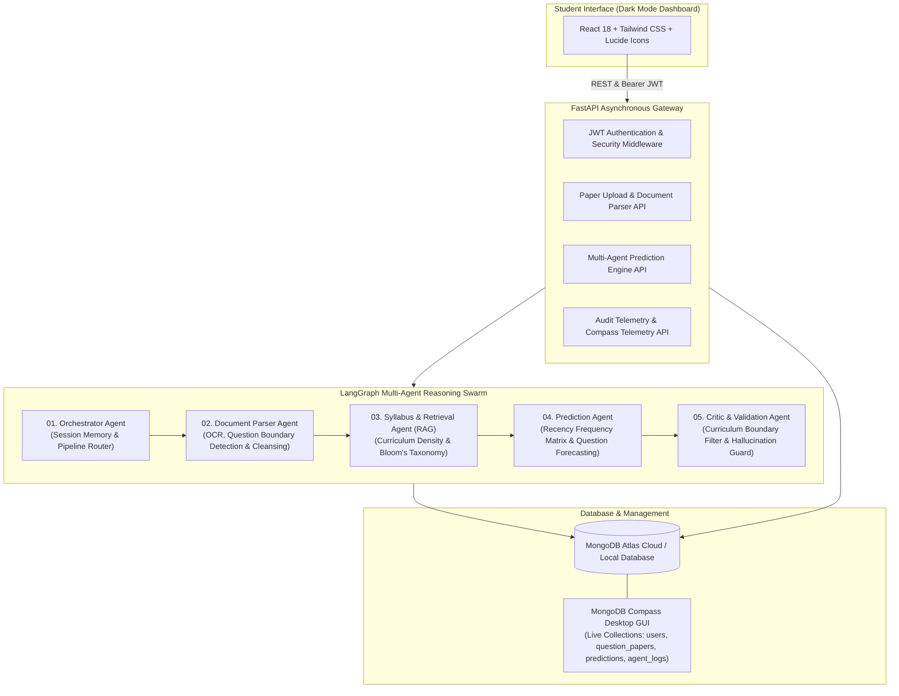

# ExamMatrix AI — Autonomous Student Multi-Agent Intelligence & Question Prediction Platform

[](https://opensource.org/licenses/MIT)
[](https://fastapi.tiangolo.com)
[](https://langchain.com)
[](https://www.mongodb.com/)
[](https://react.dev/)
[](https://tailwindcss.com/)

An end-to-end, production-grade **Multi-Agent Artificial Intelligence System** designed for B.Tech and university students. It ingests Previous Year Question Papers (PYQs) and syllabi, executes a 5-node directed state graph pipeline (LangGraph), calculates curriculum topic density and Bloom's Taxonomy distributions, and predicts future exam questions with high statistical precision.

---

## 🏛️ System Architecture



---

## 🤖 5-Agent Collaborative Swarm

| Agent Node | Responsibility | Technique / Output |
| :--- | :--- | :--- |
| **1. Orchestrator Agent** | Validates session context, target university, and coordinates pipeline execution | Session state management & directed graph routing |
| **2. Document Parser Agent** | Extracts and structures unstructured PDF/TXT question papers | OCR sanitization, question numbering extraction, Part A/B division |
| **3. Syllabus Retrieval (RAG)** | Cross-references parsed questions against official university syllabus units | Topic density calculation, Bloom's Taxonomy categorization (L1–L5) |
| **4. Question Prediction Agent** | Synthesizes high-probability upcoming exam questions with solution outlines | Recency-weighted frequency matrix & model answers |
| **5. Critic & Validation Agent** | Verifies generated questions against curriculum constraints | Hallucination suppression & confidence score normalization |

---

## 🗄️ MongoDB Database Schema & Compass Connection

Connect **MongoDB Compass** directly to inspect your live database, view student activity, and audit agent execution logs for future system training.

### Collections Overview:
1. `users`: Student accounts, hashed passwords (bcrypt), universities, and roles.
2. `question_papers`: Uploaded PYQ files, extracted questions array, and exam years.
3. `predictions`: Generated question sets, probability ratings (Crucial, High, Medium), and confidence scores.
4. `agent_logs`: Telemetry tracking agent latency, reasoning traces, and audit logs used for reinforcement learning and model fine-tuning.

### Connecting with MongoDB Compass:
1. Open **MongoDB Compass** on your desktop.
2. In the "New Connection" screen, paste your connection URI:
   ```text
   # Cloud Atlas:
   mongodb+srv://<username>:<password>@cluster0.mongodb.net/student_db?retryWrites=true&w=majority

   # Or Local MongoDB:
   mongodb://localhost:27017/student_db
   ```
3. Click **Connect**. Open the `student_db` database to explore collections visually!

---

## 🚀 Quick Start Guide (Run Locally)

### 1. Backend Setup (FastAPI)
```bash
# Navigate to backend
cd backend

# Create virtual environment
python -m venv venv
venv\Scripts\activate   # On Windows
# source venv/bin/activate # On Linux/macOS

# Install dependencies
pip install -r requirements.txt

# Start backend server
uvicorn app.main:app --reload --port 8000
```
- API Docs: `http://localhost:8000/docs`
- Healthcheck: `http://localhost:8000/`

### 2. Frontend Setup (React + Tailwind)
```bash
# Navigate to frontend
cd frontend

# Install dependencies
npm install

# Start development server
npm run dev
```
- Web Application: `http://localhost:3000`

---

## ☁️ 100% Free Production Deployment

### Backend Deployment on Render (or Hugging Face Spaces):
1. Push this repository to GitHub: `https://github.com/pratyush-h/-Pratyush`
2. Create an account on [Render](https://render.com).
3. Click **New +** → **Web Service** → Select `pratyush-h/-Pratyush`.
4. Configure settings:
   - **Root Directory**: `backend`
   - **Build Command**: `pip install -r requirements.txt`
   - **Start Command**: `uvicorn app.main:app --host 0.0.0.0 --port $PORT`
5. Add Environment Variables:
   - `MONGO_DETAILS`: Your MongoDB Atlas URI.
   - `SECRET_KEY`: A secure random JWT secret string.
   - `GEMINI_API_KEY`: (Optional) Your Google Gemini API key.

### Frontend Deployment on Vercel:
1. Log in to [Vercel](https://vercel.com) with GitHub.
2. Click **Add New Project** → Import `pratyush-h/-Pratyush`.
3. Set **Root Directory** to `frontend`.
4. Framework Preset: **Vite**.
5. Add Environment Variable:
   - `VITE_API_URL`: Your deployed Render backend URL.
6. Click **Deploy**. Vercel will build and assign your free live HTTPS URL.

---

## 🎓 Academic Relevance for Final-Year B.Tech Evaluation
- **Architectural Separation**: Decoupled asynchronous REST backend + modern dark-theme React SPA.
- **Novel Multi-Agent Coordination**: Replaces monolithic LLM prompting with a 5-stage supervised StateGraph pipeline.
- **Bloom's Cognitive Domain Mapping**: Evaluates recall vs. practical algorithmic problem-solving.
- **Production Audit Trail**: Complete telemetric recording in MongoDB Atlas / Compass.

---

## 📄 License
This project is open-source and free under the [MIT License](LICENSE).
